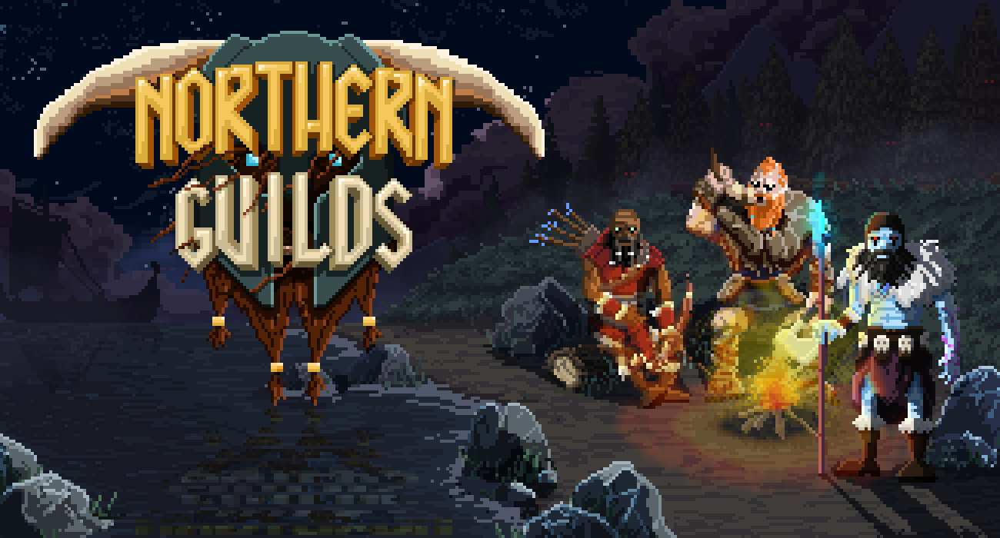

# northern-guilds-portfolio

Northern Guilds was a browser-based pixel-art MMO, and I was the lead developer on the project.  You can play the tech demo I created, here: https://billautomata.github.io/link/to/game.

I worked on:
* Building a game engine with a custom render pipeline.
* Generating 2D character sprite sheets from animated 3D voxel models.
* Procedurally generating the environment from GIS data.

## Game engine with custom render pipeline
Using Pixi.js I created a multi-pass 2D rendering pipeline that has support for real-time lighting, shadows, animated procedural environment textures (grass, water), and animated procedural visual effects (fog).

You can play it here: link.

<video src="https://billautomata.github.io/northern-guilds-portfolio/debug-mode-engine-demo.mp4" width="100%" />

## programatically generate sprite sheets

## procedurally generate the environment
adskdk3k jdjdj

<!-- <video src="./water-effect-example.mp4" width="720"/> -->

<video src="https://user-images.githubusercontent.com/432483/187026682-13a5df97-d184-43fc-9c06-976977f42053.mp4" width="100%" />

