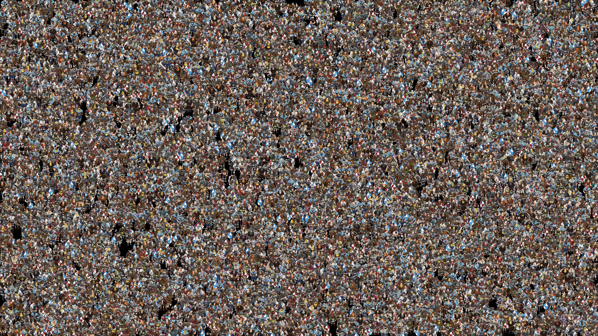

# northern-guilds-portfolio

Northern Guilds was a browser-based pixel-art MMO, and I was the lead developer on the project.  You can play the tech demo I created, here: https://billautomata.github.io/link/to/game.

I worked on:
* Building a game engine with a custom render pipeline.
* Generating 2D character sprite sheets from animated 3D voxel models.
* Procedurally generating the environment from GIS data.

## Game engine with custom render pipeline
Using Pixi.js I created a multi-pass 2D rendering pipeline that has support for real-time lighting, shadows, animated procedural environment textures (grass, water), and animated procedural visual effects (fog).

You can play an early tech demo here: link.

[https://billautomata.github.io/northern-guilds-portfolio/debug-mode-engine-demo.mp4](https://user-images.githubusercontent.com/432483/187064007-0a2aa47c-a0e9-4ef7-ac23-ff86c93614c0.mp4)

The video above shows the framebuffers for each stage of the render pipeline, culminating in the compositor.  Some layers are only active when there are emissive elements in the scene.

[https://billautomata.github.io/northern-guilds-portfolio/huge_stairs.mp4](https://user-images.githubusercontent.com/432483/187064306-6e1b333d-6de5-45a2-9d85-27c44a3e5ebd.mp4)

This video above demonstrates the environment displacement effect I developed.

## programatically generate sprite sheets

## procedurally generate the environment
adskdk3k jdjdj

<video src="https://user-images.githubusercontent.com/432483/187026682-13a5df97-d184-43fc-9c06-976977f42053.mp4" width="100%"></video>

