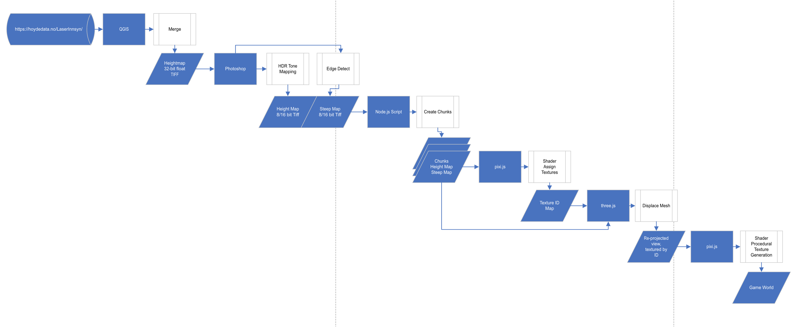

# northern-guilds-portfolio

Northern Guilds was a browser-based pixel-art MMO, and I was the lead developer on the project.  

You can play the early tech demo I created, here: https://billautomata.github.io/link/to/game.

I worked on:
* Building a game engine with a custom render pipeline.
* Generating 2D character sprite sheets from animated 3D voxel models.
* Procedurally generating the environment from GIS data.

## Game engine with custom render pipeline
Using Pixi.js I created a multi-pass 2D rendering pipeline that has support for real-time lighting, shadows, animated procedural environment textures (grass, water), and animated procedural visual effects (fog).

You can play an early tech demo here: link.

Above is the game map for the tech demo.

Above is an in-engine demonstration of the real-time lighting, shadows, visual effects, and post processing the engine performed.  This is all custom shader work done by me.

[https://billautomata.github.io/northern-guilds-portfolio/debug-mode-engine-demo.mp4](https://user-images.githubusercontent.com/432483/187064007-0a2aa47c-a0e9-4ef7-ac23-ff86c93614c0.mp4)

The video above shows the framebuffers for each stage of the render pipeline, culminating in the compositor.  Some layers are only active when there are emissive elements in the scene.

[https://billautomata.github.io/northern-guilds-portfolio/huge_stairs.mp4](https://user-images.githubusercontent.com/432483/187064306-6e1b333d-6de5-45a2-9d85-27c44a3e5ebd.mp4)

The video above demonstrates the environment displacement effect I developed.

<video src="https://user-images.githubusercontent.com/432483/187026682-13a5df97-d184-43fc-9c06-976977f42053.mp4" width="100%"></video>

The video above demonstrates the fullscreen shader effects used to blend grass and mud tiles, and animate the water.

## 2D character sprite sheets from animated 3D voxel models
The art style required 8 directional 2D sprite sheets for the characters.  There were 10,000 configurations of character models and props at launch, so I developed a set of tools that rendered a large collection of voxel models to high quality sprite sheets that preserved the art style.

Above is a photo from a presentation I gave internally about the animation tool I was developing for the art team.

Above are the voxel models used to generate sprite sheets.

Above are all the 2D characters generated by the artists.

Above is the output of the process running live in the game.  You can play an early tech demo with the characters here: link.

[sprite-sheets-sheet.mov](https://user-images.githubusercontent.com/432483/187065665-715638ea-ad4c-4076-a5c7-d459f5a0ba4b.mov)

Above is a view of an intermediate character render with a weapon.  These are mulitiple animations, and you can see all eight directions.

Above is an example of how I was able to correctly preserve important details while downscaling using a custom image processing algorithm.

## Procedurally generate the environment from GIS data.
The world map was based on the Lofoten Islands in Norway.  We wanted to feature certain areas accurately so I built a series of tools to process the 1 meter laser scan resolution (32-bit tiff, 72GB) and create the game environment.

Above is pulled from a slide given during an internal presentation about the environment generation process.

https://user-images.githubusercontent.com/432483/187067035-9f9ec39c-97e3-44eb-a9a2-2976eff321e2.mp4

Above is a rendering of how the shader flowgraph is affected by elevation.

Above is the shader flowgraph that determines the biome based on the GIS data.

https://user-images.githubusercontent.com/432483/187067047-158a4c82-9bee-4715-bd2a-ed9e009a0910.mp4

